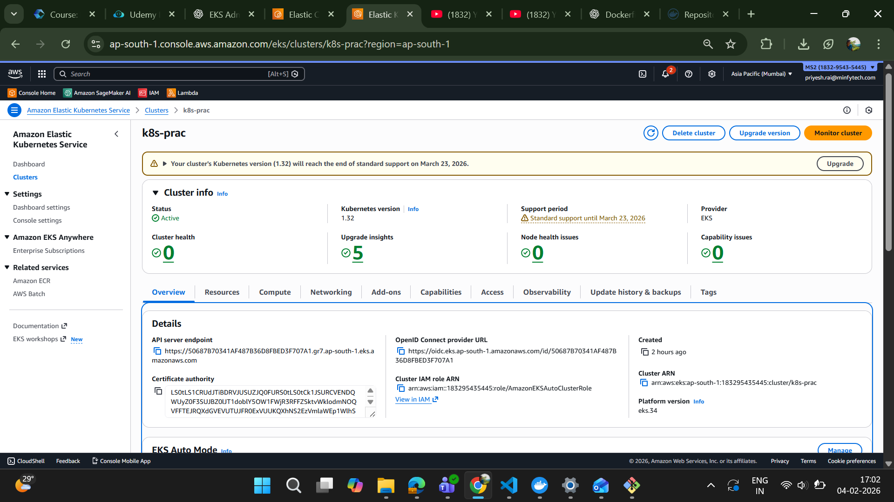
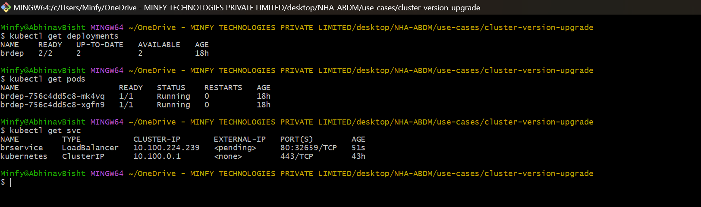
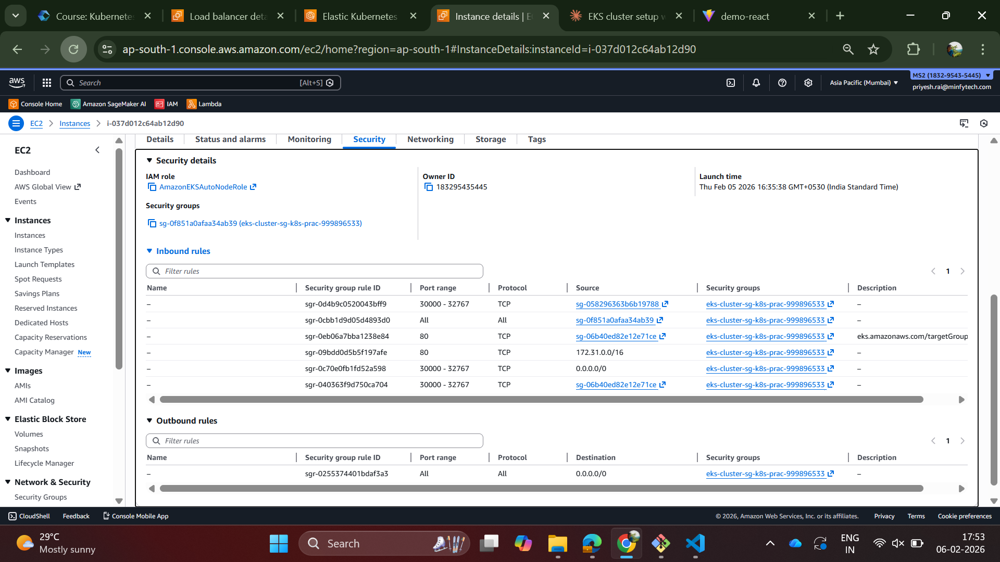
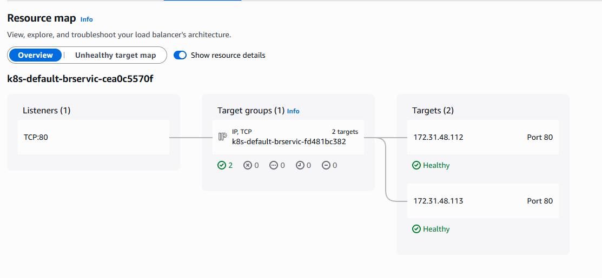
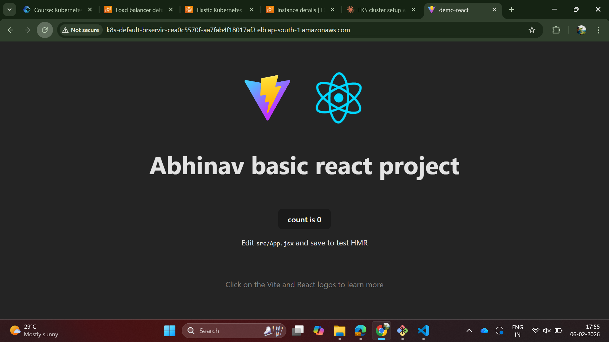
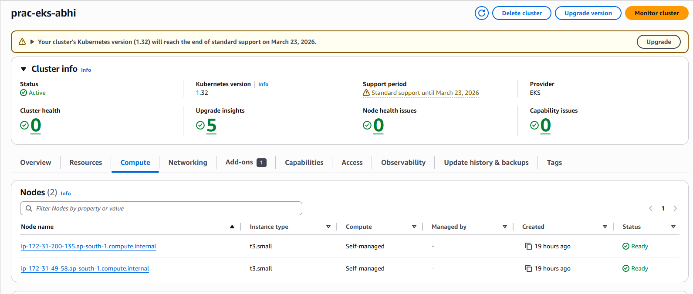
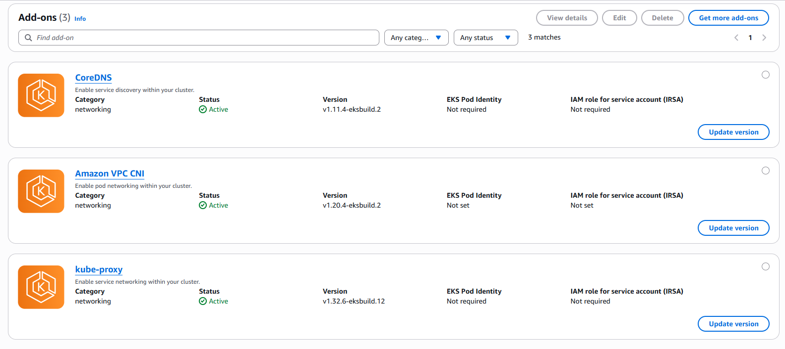
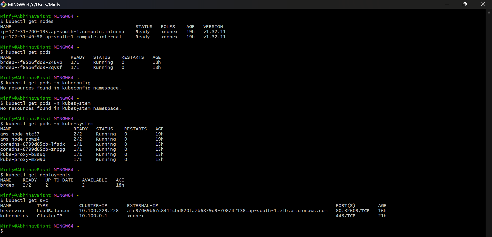
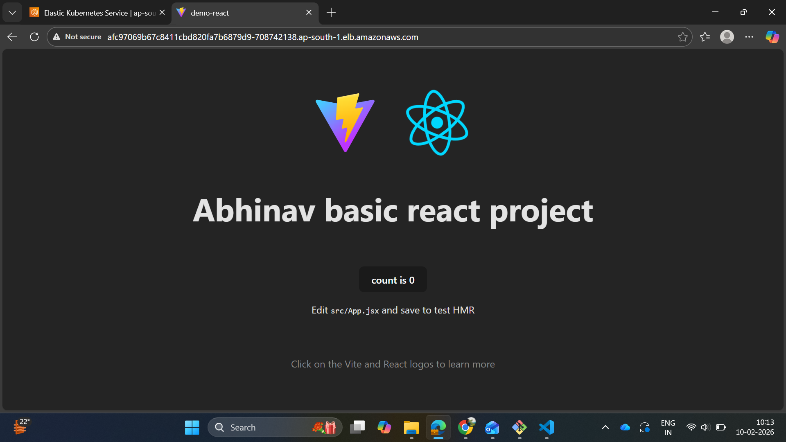

# using managed_auto

cluster creation:

deployment, pod, service creation:

the load balance:

the running node sg's:

resource map:

deployed website:

# self-managed

cluster:

add-ons, manually downloaded:

resources: 

deployed website:
