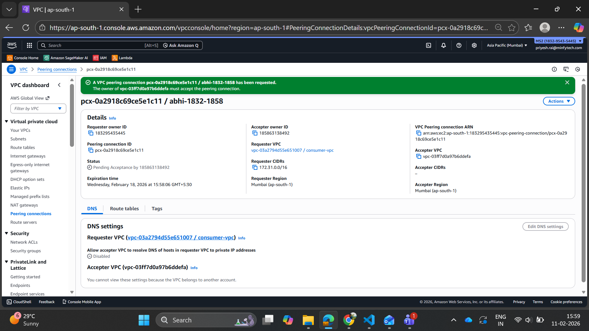
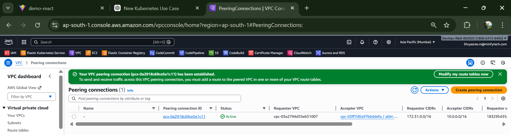
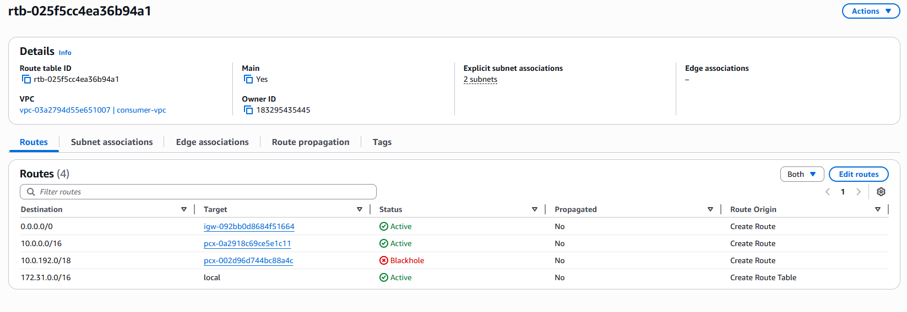
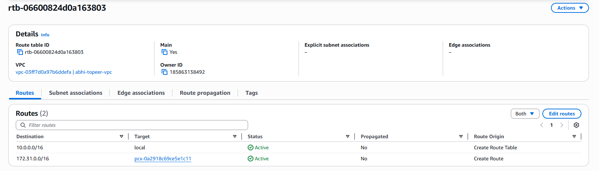
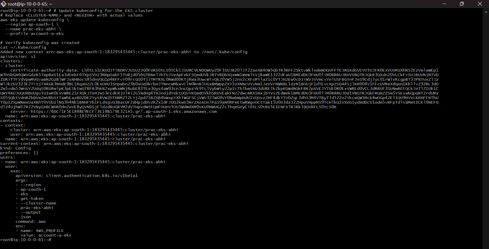

# cross account access

## peering connection

## added the routes to respective Route Tables

## iam tasks

Account A (Cluster Account)

Role: EKS-CrossAccount-Access-Role:
- Cross-Account Trust Policy: Allows Account B (185863138492) to assume this role, Enables sts:AssumeRole
- EKS Describe Policy: Allows eks:DescribeCluster, Allows eks:ListClusters, Enables fetching cluster endpoint + authentication token

Account B (EC2 Account)

Role: EC2-EKS-CrossAccount-Role:
- EC2 Trust Policy: Allows ec2.amazonaws.com to assume this role, Enables instance profile attachment
- Assume Account A Role Policy: Allows sts:AssumeRole, Target: arn:aws:iam::183295435445:role, EKS-CrossAccount-Access-Role, Enables cross-account role assumption

## kubeconfig installed and configured on ec2 account-b

The EKS cluster is configured with authenticationMode = API, which means it does not use the traditional aws-auth ConfigMap for IAM-to-Kubernetes authentication. Instead, it relies entirely on EKS Access Entries. After creating the required IAM roles and policies in both accounts, we created an Access Entry in Account A for the cross-account role (EKS-CrossAccount-Access-Role) and associated it with the AmazonEKSClusterAdminPolicy. This step allows that IAM role to be recognized by EKS and granted Kubernetes cluster-admin permissions.

On the EC2 instance in Account B, the instance profile role is allowed to assume the cross-account role in Account A using sts:AssumeRole. When kubectl is executed, the kubeconfig file does not store static credentials or tokens. Instead, it is configured to dynamically run aws eks get-token through the AWS CLI. The AWS CLI assumes the Account A role, generates a short-lived signed authentication token using STS, and provides it to kubectl. This token is sent to the EKS API server, which verifies the IAM identity against the configured Access Entry. Since the role has an associated cluster-admin access policy, the request is authorized and full Kubernetes access is granted.

In summary, the authentication flow is: EC2 instance role → assume cross-account role → generate EKS token → EKS validates via Access Entry → Kubernetes RBAC permissions applied.

## Working

in account-b instance:

## also Note:-

make sure you have authentication modes other than API, set up in your k8s cluster!!

Minfy@AbhinavBisht MINGW64 ~
$ aws sts get-caller-identity
{
    "UserId": "AIDASVLKCMK2R44QTKQLP",
    "Account": "183295435445",
    "Arn": "arn:aws:iam::183295435445:user/divyasree.m@minfytech.com"
}

Minfy@AbhinavBisht MINGW64 ~
$ aws eks describe-cluster \
  --name prac-eks-abhi \
  --region ap-south-1 \
  --query cluster.accessConfig.authenticationMode
"API"

Minfy@AbhinavBisht MINGW64 ~
$ aws eks create-access-entry \
  --cluster-name prac-eks-abhi \
  --principal-arn arn:aws:iam::183295435445:role/EKS-CrossAccount-Access-Role \
  --type STANDARD \
  --region ap-south-1
{
    "accessEntry": {
        "clusterName": "prac-eks-abhi",
        "principalArn": "arn:aws:iam::183295435445:role/EKS-CrossAccount-Access-Role",
        "kubernetesGroups": [],
        "accessEntryArn": "arn:aws:eks:ap-south-1:183295435445:access-entry/prac-eks-abhi/role/183295435445/EKS-CrossAccount-Access-Role/d4ce28db-711f-1860-e0d8-9385011064b5",
        "createdAt": "2026-02-12T17:27:45.955000+05:30",
        "modifiedAt": "2026-02-12T17:27:45.955000+05:30",
        "tags": {},
        "username": "arn:aws:sts::183295435445:assumed-role/EKS-CrossAccount-Access-Role/{{SessionName}}",
        "type": "STANDARD"
    }
}

Minfy@AbhinavBisht MINGW64 ~
$ aws eks associate-access-policy \
  --cluster-name prac-eks-abhi \
  --principal-arn arn:aws:iam::183295435445:role/EKS-CrossAccount-Access-Role \
  --policy-arn arn:aws:eks::aws:cluster-access-policy/AmazonEKSClusterAdminPolicy \
  --access-scope type=cluster \
  --region ap-south-1
{
    "clusterName": "prac-eks-abhi",
    "principalArn": "arn:aws:iam::183295435445:role/EKS-CrossAccount-Access-Role",
    "associatedAccessPolicy": {
        "policyArn": "arn:aws:eks::aws:cluster-access-policy/AmazonEKSClusterAdminPolicy",
        "accessScope": {
            "type": "cluster",
            "namespaces": []
        },
        "associatedAt": "2026-02-12T17:28:03.434000+05:30",
        "modifiedAt": "2026-02-12T17:28:03.434000+05:30"
    }
}

Minfy@AbhinavBisht MINGW64 ~
$ aws eks list-access-entries \
  --cluster-name prac-eks-abhi \
  --region ap-south-1
{
    "accessEntries": [
        "arn:aws:iam::183295435445:role/EKS-CrossAccount-Access-Role",
        "arn:aws:iam::183295435445:role/aws-service-role/eks.amazonaws.com/AWSServiceRoleForAmazonEKS",
        "arn:aws:iam::183295435445:role/eksctl-prac-eks-abhi-nodegroup-ubu-NodeInstanceRole-7WFIgW9P4vyy",
        "arn:aws:iam::183295435445:user/divyasree.m@minfytech.com",
        "arn:aws:iam::183295435445:user/priyesh.rai@minfytech.com"
    ]
}

