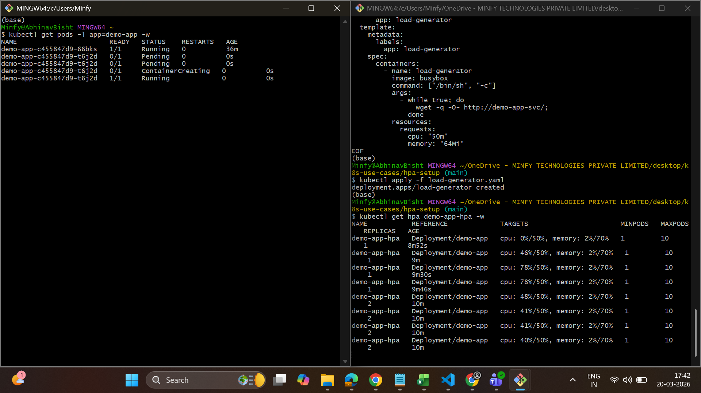

# Horizontal Pod Autoscaler (HPA)
### EKS + Karpenter Integration — Implementation Guide
> **Author:** Abhinav | **Environment:** AWS EKS ap-south-1 | **K8s:** v1.35

---

## 1. Overview

Horizontal Pod Autoscaler (HPA) automatically scales the number of pods in a Deployment based on observed resource utilisation. Combined with Karpenter for node autoscaling, this creates a fully automated, cost-efficient infrastructure that responds to real application load.

---

## 2. How HPA + Karpenter Work Together

The two autoscalers operate at different layers and complement each other:

| Layer | Component | What it scales | Trigger |
|---|---|---|---|
| Application | HPA | Pod replicas | CPU / Memory utilisation |
| Infrastructure | Karpenter | EC2 Nodes | Pending (unschedulable) pods |

**End-to-end flow:**

```
Load increases
  → HPA detects CPU/memory above threshold
    → HPA adds pod replicas
      → New pods become Pending (no node capacity)
        → Karpenter detects Pending pods
          → Karpenter provisions right-sized EC2 node
            → Pods schedule and run
              → Load drops → HPA removes pods
                → Karpenter consolidates and terminates empty nodes
```

> **Note:** HPA requires the Kubernetes Metrics Server to be installed. Without it, HPA cannot read CPU or memory utilisation and will remain inactive.

---

## 3. Prerequisites

| Requirement | Status | Notes |
|---|---|---|
| EKS Cluster | Required | v1.35 used in this setup |
| Karpenter | Required | v0.37.0 — see Karpenter README |
| kubectl access | Required | Configured for target cluster |
| Metrics Server | Install in Step 4 | Not installed by default on EKS |
| Demo app | Install in Step 5 | nginx:alpine used for POC |

---

## 4. Install Metrics Server

Metrics Server collects CPU and memory usage from each node's kubelet and exposes it through the Kubernetes API. HPA queries this API every 15 seconds to make scaling decisions.

### 4.1 Install

```bash
kubectl apply -f https://github.com/kubernetes-sigs/metrics-server/releases/latest/download/components.yaml
```

### 4.2 Verify

```bash
kubectl get deployment metrics-server -n kube-system
kubectl top nodes
```

Expected output:
```
NAME                                     CPU(cores)   CPU%   MEMORY(bytes)   MEMORY%
ip-172-31-33-49.ap-south-1.internal     112m         11%    612Mi           32%
```

### 4.3 EKS TLS Fix (if `kubectl top nodes` hangs)

On EKS, metrics-server may fail with a TLS error. Apply this patch:

```bash
kubectl patch deployment metrics-server -n kube-system \
  --type='json' \
  -p='[{"op":"add","path":"/spec/template/spec/containers/0/args/-","value":"--kubelet-insecure-tls"}]'
```

---

## 5. Deploy Demo Application

A lightweight nginx deployment is used for this POC. The key requirement for HPA is that **resource requests must be defined** on every container — HPA calculates utilisation as `(actual usage / request)`.

### 5.1 demo-app.yaml

```bash
cat > demo-app.yaml << 'EOF'
apiVersion: apps/v1
kind: Deployment
metadata:
  name: demo-app
  labels:
    app: demo-app
spec:
  replicas: 1
  selector:
    matchLabels:
      app: demo-app
  template:
    metadata:
      labels:
        app: demo-app
    spec:
      containers:
        - name: demo-app
          image: nginx:alpine
          ports:
            - containerPort: 80
          resources:
            requests:
              cpu: "100m"
              memory: "128Mi"
            limits:
              cpu: "200m"
              memory: "256Mi"
---
apiVersion: v1
kind: Service
metadata:
  name: demo-app-svc
spec:
  selector:
    app: demo-app
  ports:
    - port: 80
      targetPort: 80
EOF
```

### 5.2 Apply

```bash
kubectl apply -f demo-app.yaml
kubectl get pods -l app=demo-app
```

> ⚠️ `resources.requests` is mandatory for HPA. Without it, Kubernetes cannot calculate utilisation percentage and HPA will show `<unknown>` for metrics.

---

## 6. Configure HPA

### 6.1 hpa.yaml

```bash
cat > hpa.yaml << 'EOF'
apiVersion: autoscaling/v2
kind: HorizontalPodAutoscaler
metadata:
  name: demo-app-hpa
spec:
  scaleTargetRef:
    apiVersion: apps/v1
    kind: Deployment
    name: demo-app
  minReplicas: 1
  maxReplicas: 10
  metrics:
    - type: Resource
      resource:
        name: cpu
        target:
          type: Utilization
          averageUtilization: 50
    - type: Resource
      resource:
        name: memory
        target:
          type: Utilization
          averageUtilization: 70
  behavior:
    scaleUp:
      stabilizationWindowSeconds: 30
      policies:
        - type: Pods
          value: 2
          periodSeconds: 30
    scaleDown:
      stabilizationWindowSeconds: 30
      policies:
        - type: Pods
          value: 1
          periodSeconds: 61
EOF
```

### 6.2 Configuration Explained

| Field | Value | Purpose |
|---|---|---|
| `minReplicas` | 1 | Always keep at least 1 pod running |
| `maxReplicas` | 10 | Hard ceiling — never exceed 10 pods |
| `cpu averageUtilization` | 50% | Scale up when avg CPU > 50% of request (100m) |
| `memory averageUtilization` | 70% | Scale up when avg memory > 70% of request (128Mi) |
| `scaleUp stabilization` | 30s | Wait 30s before acting on a spike to avoid flapping |
| `scaleUp policy` | 2 pods / 30s | Add max 2 pods every 30s — gradual scale-up |
| `scaleDown stabilization` | 30s | Wait 30s of sustained low load before scaling down |
| `scaleDown policy` | 1 pod / 61s | Remove max 1 pod per 61s — conservative scale-down |

### 6.3 Apply and Verify

```bash
kubectl apply -f hpa.yaml
kubectl get hpa demo-app-hpa
```

Expected output:
```
NAME           REFERENCE             TARGETS                       MINPODS   MAXPODS   REPLICAS
demo-app-hpa   Deployment/demo-app   cpu: 0%/50%, memory: 2%/70%   1         10        1
```

> ✅ Both metrics showing real values (not `<unknown>`) confirms Metrics Server is working and HPA is correctly wired to the deployment.

---

## 7. Load Test

### 7.1 Load Generator

```bash
cat > load-generator.yaml << 'EOF'
apiVersion: apps/v1
kind: Deployment
metadata:
  name: load-generator
spec:
  replicas: 1
  selector:
    matchLabels:
      app: load-generator
  template:
    metadata:
      labels:
        app: load-generator
    spec:
      containers:
        - name: load-generator
          image: busybox
          command: ["/bin/sh", "-c"]
          args:
            - while true; do
                wget -q -O- http://demo-app-svc/;
              done
          resources:
            requests:
              cpu: "50m"
              memory: "64Mi"
EOF
```

```bash
kubectl apply -f load-generator.yaml
```

### 7.2 Watch Autoscaling in Real Time

Run these in separate terminals simultaneously:

```bash
# Terminal 1 — HPA decisions
kubectl get hpa demo-app-hpa -w

# Terminal 2 — Pod scaling
kubectl get pods -l app=demo-app -w

# Terminal 3 — Node provisioning (Karpenter)
kubectl get nodes -w
```

---

## 8. Observed Results

Actual output captured during load test:

```
NAME           REFERENCE             TARGETS                        REPLICAS
demo-app-hpa   Deployment/demo-app   cpu: 0%/50%,  memory: 2%/70%   1       ← baseline
demo-app-hpa   Deployment/demo-app   cpu: 46%/50%, memory: 2%/70%   1       ← load building
demo-app-hpa   Deployment/demo-app   cpu: 78%/50%, memory: 2%/70%   1       ← threshold breached
demo-app-hpa   Deployment/demo-app   cpu: 48%/50%, memory: 2%/70%   2       ← scaled to 2 replicas
demo-app-hpa   Deployment/demo-app   cpu: 41%/50%, memory: 2%/70%   2       ← load distributed
demo-app-hpa   Deployment/demo-app   cpu: 31%/50%, memory: 2%/70%   2       ← stabilising
```

---

### Production recommendations

| Recommendation | Detail |
|---|---|
| Set resource requests accurately | HPA accuracy depends on requests being realistic. Too low = premature scaling. Too high = delayed scaling. |
| Use PodDisruptionBudgets | Protect availability during scale-down events by defining `minAvailable` on critical deployments. |
| Tune stabilization windows | `scaleDown stabilizationWindowSeconds` should be 120-300s in production to prevent flapping. |
| Memory thresholds | Memory does not compress like CPU — a pod at 90% memory may OOMKill before HPA reacts. Set memory thresholds conservatively (60-70%). |
| Multiple NodePools | Use separate Karpenter NodePools for spot (cost) and on-demand (stability) and target workloads accordingly. |

### HPA Scaling Formula

HPA uses this formula to calculate desired replicas:

```
desiredReplicas = ceil(currentReplicas * (currentMetricValue / desiredMetricValue))

Example:
  currentReplicas  = 1
  currentCPU       = 78%
  targetCPU        = 50%
  desiredReplicas  = ceil(1 * (78 / 50)) = ceil(1.56) = 2
```

> When multiple metrics are configured (CPU + memory), HPA calculates desired replicas for each metric independently and takes the **maximum** value. This ensures the most constrained resource drives scaling.

---


